# Locality Sensitive Hashing

Locality Sensitive Hashing (LSH) is a powerful technique for efficiently approximating nearest neighbor searches in high-dimensional spaces. This library provides an optimized implementation of LSH, enabling fast similarity searches across large datasets. By hashing similar input items into the same "buckets" with high probability, LSH significantly reduces the computational cost associated with traditional search methods.

Key Features

- **Euclidean Distance:** Many LSH implementations use cosine or jaccard distance. This library uses euclidean distance, which is better or even required for many use cases.
- **Optimal Parameter Selection:** Automatically determines the best parameters for LSH based on the characteristics of your data, ensuring high performance and accuracy.
- **Flexible Design:** Custom bucket implementations and bucket storage implementations allow flexible adaption to the use case at hand.

While the LSH algorithm itself is relatively simple, determining the parameters for it is tricky. This library contains both an implementation of LSH and the utilities to determine the optimal parameters, based on [Slaney2012](<Slaney2012(OptimalLSH).pdf>).

## Usage

LSH assigns points to buckets in such a way that points which lie close together have a higher probability to end up in the same bucket as points which are further away. However, even points which lie very close together may up in different buckets. To reduce the probability of not finding nearby points, the indexing and lookup process is repeated multiple times. This has the following consequences:

- During indexing, each point is placed in multiple buckets
- During lookup, multiple buckets are very likely identified, and all of them have to be searched
- The parameters are chosen in such a way that few points end up in the same bucket. However, if the data is not distributed evenly, many points may end up in the same bucket. Therefore it is important to implement the buckets in such a way tha they can handle this

These concepts are reflected in the API. The `LshIndex` class only handles the mapping between points and bucket IDs and adds and retrieves the buckets from a `BucketStorage`. How data is added to and searched in buckets is handled by the caller. This allows for maximal flexibility.

A simple bucket implementation is to just store all points in a list, and search all points when querying. This is implemented in the `ListLshSet`.

First we build a data set, containing 2'000 random 100 dimensional vectors, with a point close by for each.

```c#
var d = 100;
var N = 2000;
var data = Enumerable.Range(0, N).SelectMany(_ =>
{
    var v = RandomVectors.RandomUniform(d, 0, 20, random);
    return (Vector<double>[])[v, v.Add(RandomVectors.RandomUniform(d, 0, 1, random))];
}).ToArray();
```

Then we determine the distance distribution between two random points and between a random point and it's nearest neighbor:

```c#
var dAny = ProbabilityDensityFunction.FromAnyDistances(d, data, random);
var dNn = ProbabilityDensityFunction.FromNnDistances(d, data, random);
```

If we plot this, we get

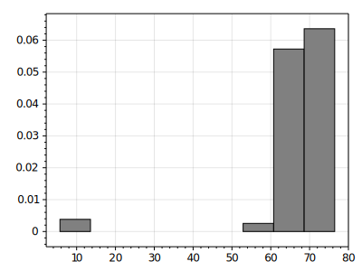

for random points and

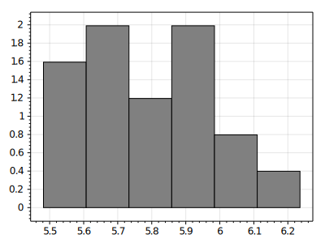

for the nearest neighbors.

We can now create a `ListLshSet` from this data and fill it and search the nearest neighbors

```c#
var set = new ListLshSet<int>(LshParameters.Calculate(data.Length, d, 0.1, dNn, dAny));
data.ForEach((v, i) => set.Add(v, i));
List<double> foundNNDistances = new();
data.ForEach((v, indexV) =>
{
    var nn = set.Query(v, (p, indexP) => indexV != indexP);
    if (nn != null)
    {
        var dist = (nn.Value.P - v).L2Norm();
        foundNNDistances.Add(dist);
    }
});
new HistogramPDF(foundNNDistances.Where(x => x < 50)).Plot("foundNN.svg");
```

Note that we had to filter out the query point itself during the query. The resulting distribution looks like this:

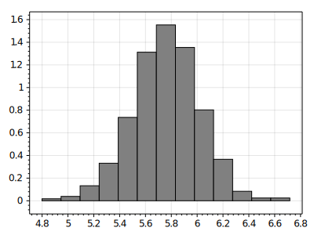

Thus we clearly succeeded at finding the nearest neighbors with high probability.

For the next demonstration we generate our data in much the same way, but without the nearest neighbors. For the nearest neighbor distance distribution, we use an unit impulse (all probability at one value). We then add a random vector of a certain length to the data points, and record the probability at which we find data point.

```c#
var data = Enumerable.Range(0, N).Select(_ => RandomVectors.RandomUniform(d, 0, 20, random)).ToArray();
foreach (var pulseValue in (double[])[5, 15, 30, 50, 70])
{
    var set = new ListLshSet<int>(LshParameters.Calculate(data.Length, d, 0.1, ProbabilityDensityFunction.FromUnitImpulse(pulseValue), dAny));
    data.ForEach(set.Add);
    for (double distance = 1; distance < 100; distance = distance * 1.2 + 1)
    {
        var nn = set.Query(v + RandomVectors.RandomGivenLength(d, distance, random));
        // record if v was found
    }
}
```

This yields the following graph:

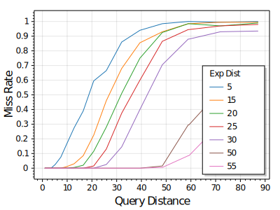

We can clearly see how the NN-distribution used during indexing equals the distance at which miss rate matches the `delta` parameter configured, 0.1 in our case. At an indexing distance of 70 the index stops working, as the expected NN distance matches or exceeds the distance between two random points.

The next graph keeps the NN-Distribution constant at 20 while varying delta:

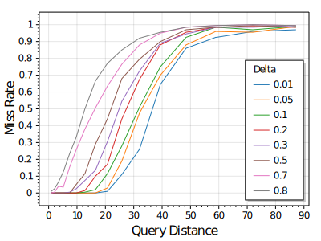

Here we clearly see how the the configured miss rate matches the miss rate at a distance of 20, which matches the NN-distribution used during indexing.

### Performance

From what you've seen so far you might conclude to just set your indexing NN-distribution a bit above of the distance you need nearest neighbors for and use a low `delta`. But we haven't yet discussed how performance is affected by these parameters. There are two costs: first finding the bucket, which involved multiplying the query vector with the index matrices. Secondly searching the buckets retrieved. The cost of searching the buckets depends heavily on the requirements and on how the buckets are implemented. For this analysis we assume you want the nearest neighbor and just store and search all points in each bucket.

We use the same two examples as above, but this time we plot both the number of multiplications required to find a bucket and the number of points evaluated when searching all points in each retrieved bucket.

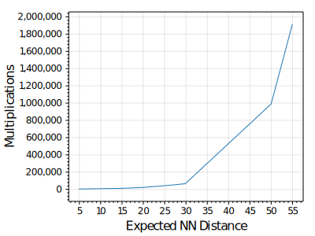
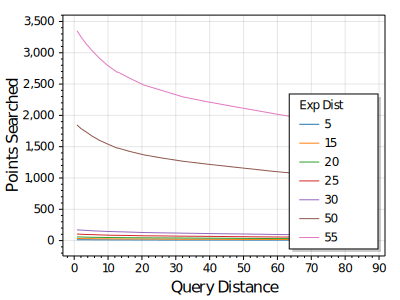

We clearly see the immense cost when getting close to the average distance between points. Here the same plots without the largest expected nn distances, to make the values more readable:

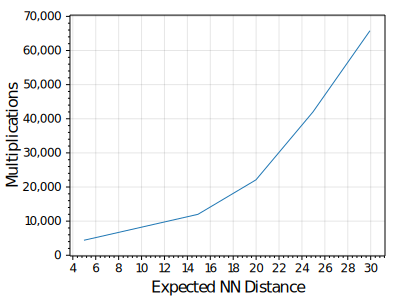
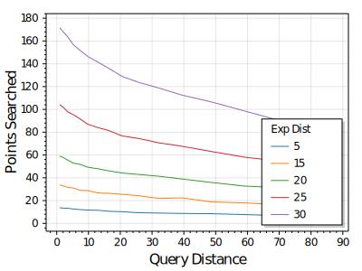

Looking at the effect of `delta` on these costs we see that increasing the delta reduces the costs, especially when looking at deltas below 0.1.

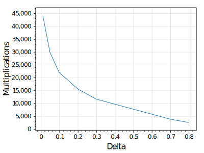
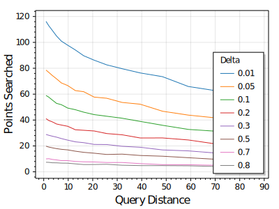

## Implementation Style

While care is taken to properly model the mathematical concepts, generalization is kept to a minimum and only the required functionality is implemented. This keeps the code base small and easy to understand. The mathematical concepts are documented in this readme instead of the code, due to the superior markup capabilities of Markdown.

## Mathematical Concepts

### Product distribution

[Wikipedia](https://en.wikipedia.org/wiki/Distribution_of_the_product_of_two_random_variables)

If $X $ and $Y $ are two independent, continuous random variables, described by probability density functions $f_X $ and $f_Y $ then the probability density function of $Z = XY$ is

$$f_Z(z) = \int^\infty_{-\infty} f_X(x)  f_Y( z/x)  \frac{1}{|x|}\, dx$$

For our purposes, we only need the multiplication between a unit normal distribution and either a histogram pdf or a unit impulse.

#### Unit Impulse

The pdf of a unit impulse $\delta(x)$ is zero everywhere except at $x=0$ and sums to one: $$1=\int^\infty_{-\infty} \delta(z)  dx $$

For $X\sim\delta(x-v)$, the pdf $f_X(x)$ is non zero only at $v$. Therefore $x$ can be treated as constant with value $v$ in the integral:

$$
\begin{align}
f_Z(z) &= \int^\infty_{-\infty} \delta(x-v)  f_Y( z/x)  \frac{1}{|x|}\, dx \\
&=  f_Y( z/v)  \frac{1}{|v|} \int^\infty_{-\infty} \delta(x-v) \, dx \\
&= f_Y( z/v)  \frac{1}{|v|}
\end{align}
$$

The probability density function of the normal distribution is

$$f_N(x|\mu,\sigma^2)= \frac{1}{\sqrt{2 \pi \sigma^2}} e^{-\frac{(x-\mu)^2}{2 \sigma^2}} $$

If we plug the formula for the unit normal distribution ($\mu=0$, $\sigma = 1$) into our equation above, we get

$$
\begin{align}
f_Z(z) &= f_N( z/v)  \frac{1}{|v|}\\
&= \frac{1}{|v|\sqrt{2 \pi}} e^{-\frac{(z/v)^2}{2 }}   \\
&= \frac{1}{\sqrt{2 \pi v^2}} e^{-\frac{z^2}{2v^2 }}   \\
&= f_N(z|0,v^2)
\end{align}
$$

Thus $Z\sim N(0,v^2)$.

#### Histogram PDF

We can treat a histogram PDF as a sum of impulses. With $n$ bins, a bin width of $w_B$ and $B_i$ and $C_i$ as the probability and center of bin $i$ respectively, we get

$$
\begin{align}
f_Z(z) &= \sum_{i=1}^n\int^\infty_{-\infty} B_iw_B \delta(z-C_i)  f_N( z/x)  \frac{1}{|x|}\, dx\\
&=\sum_{i=1}^n B_iw_B\int^\infty_{-\infty} \delta(z-C_i)  f_N( z/x)  \frac{1}{|x|}\, dx\\
&=\sum_{i=1}^n B_iw_Bf_N(z/C_i)\frac{1}{|C_i|}\\
&=\sum_{i=1}^n B_iw_Bf_N(z|0,C_i^2)\\
\end{align}
$$

From [Stack Overflow](https://stats.stackexchange.com/questions/205126/standard-deviation-for-weighted-sum-of-normal-distributions):

Two normally distributed random variable $H_0$ and $H_1$, which are combined to give the weighted distribution $H$ as follows:

$$
\begin{align}
H_0 &\sim N(\mu_0, \sigma_0)\\
H_1 &\sim N(\mu_1, \sigma_1)\\
f_H &= p * f_1(x) + (1-p)  f_0(x)
\end{align}
$$

The random variable $H$ is the mixture of two normal distributions. For the mean of $H$

$$E(H) = \int x\left(pf_1(x) + (1-p)f_0(x) \right) dx = p\mu_1 + (1-p)\mu_0. $$

Similarly for the second moment of H

$$
\begin{align*}
E(H^2)& = \int x^2 \left(pf_1(x) + (1-p)f_0(x) \right) dx\\
& = pE(H_1^2) + (1-p)E(H_0^2)\\
& = p(\sigma_1^2 + \mu_1^2) + (1-p)(\sigma_0^2 + \mu_0^2)
\end{align*}
$$

Finally,

$$
\begin{align*}
Var(H) & = E(H^2) - [E(H)]^2\\
& = p(\sigma_1^2 + \mu_1^2) + (1-p)(\sigma_0^2 + \mu_0^2) - \left[p\mu_1 + (1-p)\mu_0 \right]^2\\
& = \left[p\sigma_1^2 + (1-p)\sigma_0^2\right] + [p\mu_1^2 + (1-p)\mu_0^2]- \left[p\mu_1 + (1-p)\mu_0 \right]^2\\
& = p\sigma^2_1+(1−p)\sigma^2_0+p(1−p)(\mu_1−\mu_0)^2
\end{align*}
$$

Taking the square root of $Var(H)$, you get the standard deviation.

In our case, $\mu_0$ and $\mu_1$ are both zero, thus $\sigma^2= p\sigma^2_1+(1−p)\sigma^2_0$. Using this we can further simplify the sum above:

$$
\begin{align}
f_Z(z)&=  \sum_{i=1}^n B_iw_Bf_N(z|0,C_i^2)\\
&=  f_N(z|0,\sum_{i=1}^n (B_iw_BC_i^2))\\
\end{align}
$$
